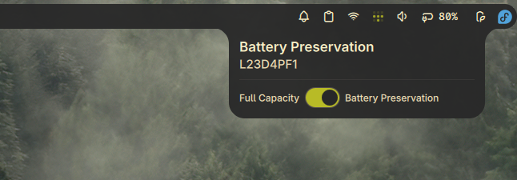

# Ideapad Battery Health

A plugin for Noctalia Shell to control the battery preservation mode on Ideapad laptops, helping extend battery lifespan. This plugin only works if your laptop supports battery conservation mode (as exported by the kernel in sysfs). The plugin looks like this in action:



## Features

- **Bar Widget**: Shows battery preservation icon in the bar
- **Panel**: Toggle battery preservation mode on/off
- **Persistent Settings**: Saves and restores preservation mode across reboots
- **Automatic Restoration**: Restores previous preservation mode when the plugin loads

## Limitations

- Currently supports only the primary battery, which this plugin expects to
  have exposed as BAT0 by sysfs.
- Specifically designed for Ideapad laptops with conservation mode support

## Usage

Add the bar widget to your bar. Click to open the panel and toggle the battery preservation mode using the switch.

### Panel Controls

- Toggle switch to enable/disable battery preservation mode
- Status indicator shows current battery model name
- Changes are applied immediately
- Settings persist across reboots

## Setup (Required)

This plugin requires write access to the battery conservation mode sysfs file. The included `setup_rules.sh` script configures a udev rule that grants write permission to members of the `battery_ctl` group:

```bash
$ sudo ./setup_rules.sh
```

This script will:

- Check for the presence of the conservation mode file (`/sys/class/power_supply/BAT0/extensions/ideapad_laptop/conservation_mode`)
- Create a `battery_ctl` group (if it doesn't exist)
- Add your user to the `battery_ctl` group
- Install the udev rule (`99-battery-preservation.rules`) to `/etc/udev/rules.d/`
- Reload udev rules

**Note:** A reboot may be required for write access to take effect.

## IPC Commands

```bash
# Toggle panel
qs -c noctalia-shell ipc call plugin:ideapad-battery-health togglePanel

# Set preservation mode (0 for disabled, 1 for enabled)
qs -c noctalia-shell ipc call plugin:ideapad-battery-health set <value>
```

## Troubleshooting

- **Read-only mode**: Ensure udev rule is installed and you're in the `battery_ctl` group
- **Not available**: Your laptop may not support battery conservation mode
- **Changes not saving**: Check write permissions on the sysfs file
- **Missing sysfs file**: Verify that `/sys/class/power_supply/BAT0/extensions/ideapad_laptop/conservation_mode` exists

## Requirements

- Ideapad laptop with battery conservation mode support
- Noctalia 3.6.0 or later
- Linux kernel exposing battery conservation mode via sysfs

## Files

This plugin consists of the following files:

- `Main.qml`: Main entry point and IPC handler
- `BatteryPreservationService.qml`: Core service for managing battery preservation
- `BarWidget.qml`: Widget displayed in the top bar
- `Panel.qml`: Panel interface for toggling preservation mode
- `manifest.json`: Plugin metadata and configuration
- `settings.json`: Default settings
- `setup_rules.sh`: Script to configure udev rules for write access
- `99-battery-preservation.rules`: Udev rule file
- `README.md`: This documentation
- `preview.png`: Preview image

## Credits

Derived from battery-threshold by Wilfred Mallawa
